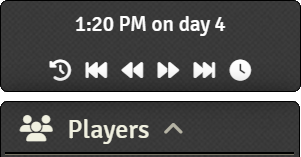
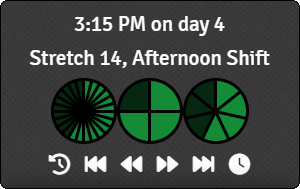
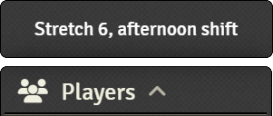
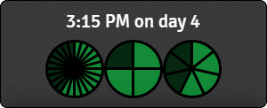
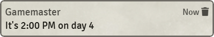

# Easy Timekeeping


[](https://foundryvtt.com/)


[](https://github.com/DC23/jd-easytimekeeping/actions/workflows/release-drafter.yml)
[](https://github.com/DC23/jd-easytimekeeping/actions/workflows/release-creation.yml)

[Easy Timekeeping](https://foundryvtt.com/packages/jd-easytimekeeping) implements simple timekeeping without any fuss or complicated features. It's a lightweight, customisable, and easy to use timekeeping tool for any game. While general purpose, this module does have default settings and some features that make it particularly suited to the [Dragonbane game system](https://foundryvtt.com/packages/dragonbane). However, those features are options that are turned off by default, and the Dragonbane system is not a dependency of Easy Timekeeping.

**Easy Timekeeping** has the following main features:

- The GM is always in control of the passage of time.

- Media buttons allow the GM to quickly change the time by configurable small and large jumps. By default these are set to 15 minutes for small changes and 6 hours for large, but these can be changed by a GM in the module settings.

    
    

- All time control buttons on the UI have keybindings, but they are unset by default. If you want to use keyboard shortcuts, you can assign keys in the Foundry Configure Controls menu for Easy Timekeeping.

- An optional daylight cycle provides configurable automation of scene lighting. Note that the daylight cycle is disabled by default. Turn it on in the module settings. Once enabled, it is active for every scene in your world. To disable daylight cycles for a single scene, use the Foundry Darkness Level Lock setting in the scene lighting configuration.

- By default, players see the exact time of day, though this can be changed. You can tell them nothing, show them the fuzzy time, or only show them the exact time at predefined intervals (see the post to chat feature below).

    

- Special modes for Dragonbane that support fuzzy time showing just the current stretch and shift in words and visual form. The precise time of day can optionally be hidden from players, with the fuzzy Dragonbane time in stretches and shifts displayed in words or graphically:

    
    

- Configurable ability to post the time to chat at regular times of day. Particularly useful when combined with the option to hide the time of day from the players on the main UI. This feature is disabled by default. Enable it in the module settings.

    

- An API allows most features to be controlled from macros, such as setting the time, incrementing or decrementing the time, querying the current time, and posting the time to chat.

- Time change events allow further automation. There is a hook for world scripts, and the ability to specify a time change handler macro through the module settings (requires GM permissions). This allows you to develop scripted events that occur in response to the passage of time, or that take place only at certain times of day.

## How Time is Reckoned

**Easy Timekeeping** splits each 24 hour day into 4 shifts:

| Name | Times | Graphical Clock Appearance |
| ---  | :--------: | :---: |
| Night| 12am - 6am |  |
| Morning| 6am - 12pm |  |
| Afternoon| 12pm - 6pm |  |
| Evening| 6pm - 12am |  |

The name of each shift can be customised in the module settings. It's primarily used in the fuzzy time but may be used
for other features in future.

The daylight cycle also splits the 24 hour day into 4 phases, called *Dawn*, *Day*, *Dusk*, and *Night*. With the default settings, these phases take place at the following times:

| Phase | Times | Description |
| ----- | ----- | ----------- |
| Dawn | 6am - 7am | Scene lighting transitions from night to day |
| Day | 7am - 6pm | Scene lighting is set to the day setting |
| Dusk | 6pm - 7pm | Scene lighting transitions from day to night |
| Night | 7pm - 6am | Scene lighting is set to the night setting |

Of course, you can change the start times and the duration of both dawn and dusk in the settings, which can make the relationship between the daylight cycle phases and the four shifts quite wobbly. That's up to you!

## The API

The [**Easy Timekeeping** API](./documentation/timekeeper.md) can be accessed from Foundry macros with:

```js
game.modules.get('jd-easytimekeeping').api
```

From macros, you can do everything that the UI allows - setting, incrementing, and decrementing the time.

### The Time Change Event

Another way to interact with **Easy Timekeeping** is through the Time Change event. This is called whenever the time changes through any means - the UI or by the API. You can listen to the event from a [World Script](https://foundryvtt.wiki/en/basics/world-scripts) by subscribing to the time change hook. For example:

```js
Hooks.on(game.modules.get(MODULE_ID).timeChangeHookName, (data) => {
    console.log(data)
})
```

If you don't want to mess around with world scripts, then as GM you can register a standard script macro in the module settings with the *Time Change Event Handler* setting. The registered macro will be called when the time changes. Unlike the hook, the data object gets exploded and your macro will receive the `oldTime` and `time` variables directly as globals.

`oldTime` and `time` (or `data.oldTime` & `data.time` in a world script) are [`timeAugmented`](./documentation/timekeeper.md#timeaugmented) objects.

## A Few Thanks

I'd like to thank a few projects and communities, without whom this project probably wouldn't exist.

- The fantastic people at the Dragonbane Community Discord (you can find a permanent invite link at [the Free League forum](https://forum.frialigan.se/viewtopic.php?t=12039)). It was a quick Foundry macro built on Global Progress Clocks that eventually led to this module.
- The equally fantastic (and occassionally the same) people at the Foundry VTT Discord. With the technical help in the `#macro-polo`, `#module-development`, and `#system-development` channels I'd be cowering under my desk by now.
- The devs of [Global Progress Clocks](https://github.com/CarlosFdez/global-progress-clocks). Thanks to the magic of MIT licencing I've adapted the radial clocks right into this module.
- The devs of [SmallTime](https://github.com/unsoluble/smalltime). While I've not used any of the code, I've drawn a lot of inspiration from the UI of SmallTime.

### What Was That About SmallTime?

Inspired by the UI? Really, is that all? What about all the rest of it? That's the funny thing. I'd implemented my [macro proof of concept](https://github.com/DC23/foundry-macros/blob/main/dbtime/dbtime-readme.md), complete with day/night lighting cycle and was well underway on this module before I knew that SmallTime even existed. I arrived at the same idea independently. And since I wrote this module primarily as a way to teach myself how to write a Foundry module, it didn't seem to matter that it did more or less the same thing. Somewhere in the Foundry Discord is the conversation where I'm asking for ideas on how to write a UI for my timekeeping module and someone mentions the way that SmallTime does things. That's the first I'd heard of it. There followed a short period of disillusionment followed by the realisation that it simply doesn't matter. I had my own ideas for a new twist on things, so here we are.
